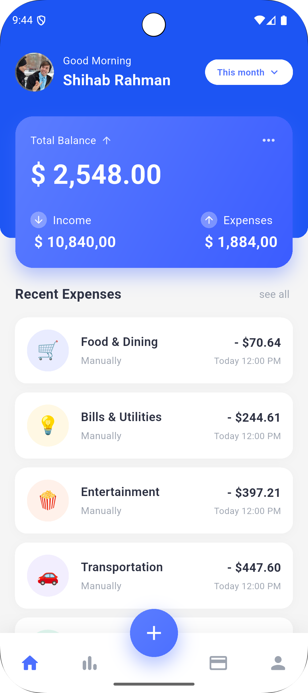
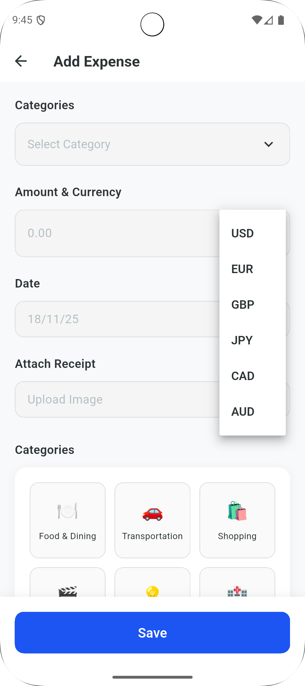
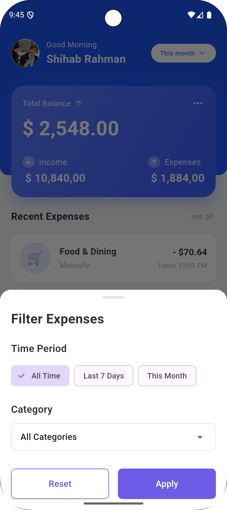

# Expense Tracker

A lightweight expense tracking mobile application built with Flutter, featuring offline support, multi-currency handling, and real-time synchronization.

---

## 📋 Table of Contents

- [Overview](#overview)
- [Architecture & Structure](#architecture--structure)
- [State Management](#state-management)
- [API Integration](#api-integration)
- [Pagination Strategy](#pagination-strategy)
- [UI Screenshots](#ui-screenshots)
- [Trade-offs & Assumptions](#trade-offs--assumptions)
- [How to Run](#how-to-run)
- [Test Credentials](#test-credentials)
- [Known Bugs & Unimplemented Features](#known-bugs--unimplemented-features)

---

## 🎯 Overview

Expense Tracker is a comprehensive mobile application designed to help users manage their personal expenses efficiently. The application provides:

- **Offline-First Architecture**: Work seamlessly without internet connectivity
- **Multi-Currency Support**: Track expenses in different currencies with automatic conversion
- **Category Management**: Organize expenses by predefined categories
- **Real-time Synchronization**: Automatic sync of offline data when online
- **Advanced Filtering**: Filter expenses by date, category, and amount
- **Local Data Persistence**: Secure local storage using Hive
- **Clean Architecture**: Separation of concerns with domain, data, and presentation layers

---

## 🏗️ Architecture & Structure

The application follows **Clean Architecture** principles with clear separation between layers:

```
lib/
├── core/                          # Core functionality
│   ├── bloc/                      # Base BLoC implementations
│   │   ├── base_bloc/            # Generic base BLoC
│   │   ├── generic_cubit/        # Generic Cubit implementation
│   │   ├── device_cubit/         # Device state management
│   │   └── value_state_manager/  # Observable value management
│   ├── constants/                # App-wide constants
│   ├── errors/                   # Error handling
│   ├── helpers/                  # Helper utilities & DI
│   ├── http/                     # HTTP client configuration
│   │   ├── dio_helper/          # Dio HTTP wrapper
│   │   └── generic_http/        # Generic HTTP implementation
│   ├── routes/                   # Navigation routes
│   ├── storage/                  # Local storage (Hive)
│   ├── theme/                    # App theming
│   └── widgets/                  # Reusable widgets
│
├── features/                      # Feature modules
│   ├── auth/                     # Authentication feature
│   │   ├── data/
│   │   │   ├── data_sources/    # Remote data sources
│   │   │   ├── models/          # Data models
│   │   │   └── repositories/    # Repository implementations
│   │   ├── domain/
│   │   │   ├── entity/          # Domain entities
│   │   │   └── repositories/    # Repository interfaces
│   │   └── presentation/
│   │       ├── manager/         # BLoCs/Cubits
│   │       └── pages/           # UI screens
│   │
│   └── expense_tracker/          # Expense tracking feature
│       ├── data/
│       │   ├── data_sources/
│       │   │   ├── expense_local_data_source.dart      # Hive local storage
│       │   │   └── impl_expense_tracker_data_source.dart # API integration
│       │   ├── model/
│       │   │   ├── expense_model/              # Expense data model
│       │   │   └── currency_rate_model/        # Currency rate model
│       │   └── repositories/
│       │       └── impl_expense_tracker_repository.dart
│       ├── domain/
│       │   ├── entity/
│       │   │   ├── expense_entity/             # Expense domain entity
│       │   │   ├── pagination_entity/          # Pagination wrapper
│       │   │   ├── expense_filter_entity/      # Filter configuration
│       │   │   └── expense_summary_entity/     # Summary statistics
│       │   ├── repositories/
│       │   │   └── expense_tracker_repository.dart
│       │   └── use_case/
│       │       ├── add_expense.dart
│       │       ├── get_expenses.dart
│       │       ├── get_currency_rate.dart
│       │       ├── get_expense_summary.dart
│       │       └── sync_offline_expenses.dart
│       └── presentation/
│           ├── manager/
│           │   ├── add_expense_cubit/          # Add expense state
│           │   ├── dashboard_cubit/            # Dashboard state
│           │   └── expense_filter_cubit/       # Filter state
│           └── pages/
│               ├── dashboard/                  # Main dashboard
│               ├── add_expense/               # Add expense screen
│               └── expense_tracker_screen/    # Expense list screen
│
└── env/                          # Environment configuration
    └── config_handler.dart
```

### Architecture Layers

1. **Presentation Layer**: 
   - UI components (Widgets)
   - State management (BLoC/Cubit)
   - View logic

2. **Domain Layer**:
   - Business logic (Use Cases)
   - Entity models
   - Repository interfaces

3. **Data Layer**:
   - Repository implementations
   - Data sources (Remote & Local)
   - Data models with serialization

---

## 🎛️ State Management

The application uses **BLoC (Business Logic Component)** pattern with multiple approaches:

### 1. Base BLoC Pattern

```dart
// Generic state wrapper with loading, success, failure states
class BaseBloc<T> extends Cubit<BaseState<T>> {
  void loadingState();
  void successState([T? data]);
  void failedState(BaseError error, VoidCallback callback);
}
```

**States:**
- `init`: Initial state
- `loading`: Data loading
- `success`: Operation successful with data
- `failure`: Operation failed with error

### 2. Generic Cubit

```dart
class GenericBloc<T> extends Cubit<GenericState<T>> {
  void onUpdateData(T data);
  void onFailedResponse({String error = ""});
  void onUpdateToInitState(T data);
}
```

**Use Cases:**
- Form state management
- UI state updates
- Simple state transitions

### 3. Feature-Specific Cubits

**DashboardExpenseCubit:**
- Manages expense list state
- Handles pagination
- Manages offline sync
- Periodic sync timer (every 5 minutes)

**ExpenseFilterCubit:**
- Filter state management
- Date range filtering
- Category filtering
- Sort order management

**AddExpenseCubit:**
- Form validation
- Currency conversion
- Receipt upload
- Offline expense creation

### State Flow Example

```
User Action → Cubit Method → Repository → Data Source → API/Local Storage
                ↓
         State Emission
                ↓
         UI Update (BlocBuilder/BlocListener)
```

---

## 🔌 API Integration

### HTTP Client Setup

The application uses **Dio** as the HTTP client with custom wrappers:

#### 1. Generic HTTP Implementation

```dart
class GenericHttpImpl<T> {
  Future<Either<Failure, T>> call(HttpRequestModel model) async {
    // Handles request method routing (GET, POST, PUT, PATCH, DELETE)
    // Response transformation
    // Error handling
  }
}
```

#### 2. Request Methods

Each HTTP method has a dedicated implementation:
- **GET**: `/lib/core/http/dio_helper/actions/get.dart`
- **POST**: `/lib/core/http/dio_helper/actions/post.dart`
- **PUT**: `/lib/core/http/dio_helper/actions/put.dart`
- **PATCH**: `/lib/core/http/dio_helper/actions/patch.dart`
- **DELETE**: `/lib/core/http/dio_helper/actions/delete.dart`

#### 3. Interceptors

- **Logging Interceptor**: Logs all requests and responses
- **Auth Interceptor**: Handles token refresh and authentication
- **Cache Interceptor**: Implements response caching with `tf_dio_cache`

#### 4. API Endpoints

Base URL: `https://api.expense-tracker.com/v1`

**Expense Endpoints:**
```dart
GET  /expenses              // Get paginated expenses with filters
POST /expenses              // Create new expense
POST /expenses/sync         // Sync offline expenses
GET  /expenses/categories   // Get expense categories
```

**Currency Endpoints:**
```
GET https://open.er-api.com/v6/latest/{currency}  // Get exchange rates
```

### API Integration Flow

1. **Request Creation**
```dart
HttpRequestModel model = HttpRequestModel(
  url: "${ApiNames.baseUrl}/expenses",
  requestMethod: RequestMethod.post,
  responseType: ResType.model,
  requestBody: expenseData,
  toJsonFunc: (json) => ExpenseModel.fromJson(json),
);
```

2. **Execution with Error Handling**
```dart
return await GenericHttpImpl<ExpenseModel>()(model);
// Returns Either<Failure, ExpenseModel>
```

3. **Repository Layer Processing**
```dart
return result.fold(
  (failure) => Left(failure),
  (success) => Right(success.toEntity()),
);
```

### Offline-First Strategy

The repository layer implements an offline-first approach:

```dart
// Always save locally first
final localModel = await localDataSource.addExpense(expense);

// Try remote sync
final remoteResult = await remoteDataSource.addExpense(expense);

return remoteResult.fold(
  (failure) => Right(localModel.toEntity()), // Return local on failure
  (success) async {
    await localDataSource.markExpenseAsSynced(localModel.id);
    return Right(success.toEntity());
  },
);
```

---

## 📄 Pagination Strategy

The application implements a **hybrid pagination approach** combining both **API pagination** and **local pagination**.

### 1. API Pagination (Remote)

When online, the app uses server-side pagination:

```dart
// Query parameters sent to API
String _buildExpenseQuery(ExpenseFilterEntity filter) {
  params.add('page=${filter.page}');
  params.add('limit=${filter.limit}');
  // Additional filters...
}
```

**Response Structure:**
```dart
class PaginationEntity<T> {
  final List<ExpenseModel> data;
  final int currentPage;
  final int totalPages;
  final int totalItems;
  final bool hasNextPage;
  final bool hasPreviousPage;
}
```

### 2. Local Pagination (Offline)

When offline, pagination is performed on locally cached data:

```dart
Future<PaginationEntity<ExpenseModel>> getExpenses(
  ExpenseFilterEntity filter,
) async {
  final box = await Hive.openBox<ExpenseModel>('expenses');
  var expenses = box.values.toList();
  
  // Apply filters
  expenses = _applyFilters(expenses, filter);
  
  // Sort by date descending
  expenses.sort((a, b) => b.date.compareTo(a.date));
  
  // Apply pagination
  final startIndex = (filter.page - 1) * filter.limit;
  final endIndex = startIndex + filter.limit;
  
  final paginatedExpenses = expenses.sublist(
    startIndex,
    endIndex > expenses.length ? expenses.length : endIndex,
  );
  
  return PaginationEntity(
    data: paginatedExpenses,
    currentPage: filter.page,
    totalPages: (expenses.length / filter.limit).ceil(),
    totalItems: expenses.length,
    hasNextPage: endIndex < expenses.length,
    hasPreviousPage: filter.page > 1,
  );
}
```

### 3. Infinite Scroll Implementation

The dashboard uses scroll listener for infinite pagination:

```dart
void _onScroll() {
  if (_scrollController.position.pixels == 
      _scrollController.position.maxScrollExtent) {
    // Load next page when reaching bottom
    _dashboardCubit.loadNextPage();
  }
}
```

### 4. Pagination Flow

```
User scrolls to bottom
    ↓
Scroll listener triggers
    ↓
Check if hasNextPage
    ↓
Increment page number
    ↓
Fetch expenses (page + 1)
    ↓
Append to existing list
    ↓
Update UI
```

### Pagination Configuration

- **Default Page Size**: 20 items per page
- **Scroll Threshold**: Bottom of list
- **Loading Indicator**: Shown at bottom during load
- **Cache Strategy**: All loaded pages cached locally

---

## 🎨 UI Screenshots

> **Note**: Add screenshots of your application here showing:
> - Login screen
> - Dashboard with expense list
> - Add expense screen
> - Filter bottom sheet
> - Expense summary cards
> - Empty state
> - Offline mode indicator

```
[Login Screen]          [Dashboard]           [Add Expense]
```

To add screenshots:
1. Take screenshots of the app running on device/emulator
2. Save them in an `assets/screenshots/` directory
3. Update this section with image links:

```markdown
### Login Screen


### Dashboard


### Add Expense


### Filter Options

```

---

## ⚖️ Trade-offs & Assumptions

### Trade-offs

1. **Offline-First vs. Real-time Accuracy**
   - ✅ **Chosen**: Offline-first with periodic sync
   - ❌ **Trade-off**: Data may be temporarily out of sync with server
   - **Reason**: Better UX in poor network conditions

2. **Local Pagination vs. Memory Usage**
   - ✅ **Chosen**: Load all cached data and paginate locally when offline
   - ❌ **Trade-off**: Higher memory usage for large datasets
   - **Reason**: Simpler implementation and faster offline experience

3. **Hive vs. SQLite**
   - ✅ **Chosen**: Hive (NoSQL key-value store)
   - ❌ **Trade-off**: Less powerful querying capabilities
   - **Reason**: Faster, lightweight, easier setup

4. **Automatic Sync vs. Manual**
   - ✅ **Chosen**: Automatic sync every 5 minutes + on app resume
   - ❌ **Trade-off**: Background battery usage
   - **Reason**: Better user experience, no manual intervention needed

5. **Generic BLoC Pattern**
   - ✅ **Chosen**: Custom base BLoC classes with generic state
   - ❌ **Trade-off**: Additional abstraction layer
   - **Reason**: Reduced boilerplate, consistent state handling

### Assumptions

1. **API Availability**
   - Assumed backend API follows RESTful conventions
   - Assumed pagination follows standard page/limit pattern
   - Assumed response structure matches defined models

2. **Currency Conversion**
   - Using free exchange rate API (open.er-api.com)
   - Rates updated when needed (not real-time)
   - Base currency assumed to be USD for conversion

3. **User Authentication**
   - Token-based authentication
   - JWT tokens stored in SharedPreferences
   - Token refresh handled automatically by interceptor

4. **Categories**
   - Fixed set of expense categories (not dynamic)
   - Categories defined in repository layer
   - No user-defined custom categories

5. **Data Sync**
   - Network connectivity checked before API calls
   - Conflicts resolved by server (last-write-wins)
   - No complex merge strategies for offline changes

6. **Receipt Upload**
   - Receipts stored as file paths or base64
   - Image compression handled by image_picker
   - No size limit enforcement (relies on backend)

7. **Testing**
   - Unit tests for critical business logic
   - Mock API responses for testing
   - No E2E tests implemented

---

## 🚀 How to Run

### Prerequisites

- **Flutter SDK**: >= 3.0.0
- **Dart SDK**: >= 3.0.0
- **IDE**: Android Studio, VS Code, or IntelliJ IDEA
- **Device**: Android emulator, iOS simulator, or physical device

### Installation Steps

1. **Clone the repository**
```bash
git clone <repository-url>
cd inovola-task
```

2. **Install dependencies**
```bash
flutter pub get
```

3. **Generate code (for Freezed, Injectable, etc.)**
```bash
flutter pub run build_runner build --delete-conflicting-outputs
```

4. **Run the app**

For Android:
```bash
flutter run
```

For iOS:
```bash
cd ios
pod install
cd ..
flutter run
```

For specific device:
```bash
flutter devices  # List available devices
flutter run -d <device-id>
```

### Development Mode

**Hot Reload**: Press `r` in terminal
**Hot Restart**: Press `R` in terminal
**Quit**: Press `q` in terminal


```

### Troubleshooting

**Issue: Build runner fails**
```bash
flutter clean
flutter pub get
flutter pub run build_runner build --delete-conflicting-outputs
```

**Issue: Pod install fails (iOS)**
```bash
cd ios
pod repo update
pod install
cd ..
```

**Issue: Gradle build fails (Android)**
```bash
cd android
./gradlew clean
cd ..
flutter clean
flutter pub get
```

---

## 🔐 Test Credentials

Use the following credentials to log in to the application:

**Email:** `inovolaTask@exa.com`  
**Password:** `12345678`

> **Note**: These credentials are for testing purposes only. In a production environment, use proper authentication mechanisms.

---

## 🐛 Known Bugs & Unimplemented Features

### Known Bugs

1. **Sync Indicator**
    - Sometimes sync indicator doesn't hide immediately after successful sync
    - **Workaround**: Pull to refresh

2. **Currency Conversion**
    - Exchange rate API may fail occasionally (free tier limitations)
    - **Workaround**: Cached rates used as fallback

3. **Image Upload**
    - Large images may cause memory issues on older devices
    - **Status**: Image compression needed

4. **Filter Persistence**
    - Filters reset when app is closed
    - **Status**: Filter state not persisted locally

## 📚 Additional Documentation

### Key Dependencies

- **flutter_bloc** (^8.1.3): State management
- **dio** (^5.3.2): HTTP client
- **hive** (^2.2.3): Local database
- **get_it** (^7.6.4): Dependency injection
- **freezed** (^2.4.6): Code generation for models
- **dartz** (^0.10.1): Functional programming (Either)
- **intl**: Internationalization
- **image_picker** (^1.0.4): Image selection

### Architecture Patterns

- **Clean Architecture**: Separation of concerns
- **Repository Pattern**: Data abstraction
- **BLoC Pattern**: State management
- **Dependency Injection**: GetIt/Injectable
- **Either Monad**: Error handling with Dartz

### Performance Considerations

- Lazy loading of images with cached_network_image
- Pagination to limit memory usage
- Hive for fast local storage
- Dio cache for reduced network calls

---

## 👥 Contributing

1. Fork the repository
2. Create a feature branch (`git checkout -b feature/amazing-feature`)
3. Commit your changes (`git commit -m 'Add amazing feature'`)
4. Push to the branch (`git push origin feature/amazing-feature`)
5. Open a Pull Request

---

## 📄 License

This project is for demonstration purposes.
